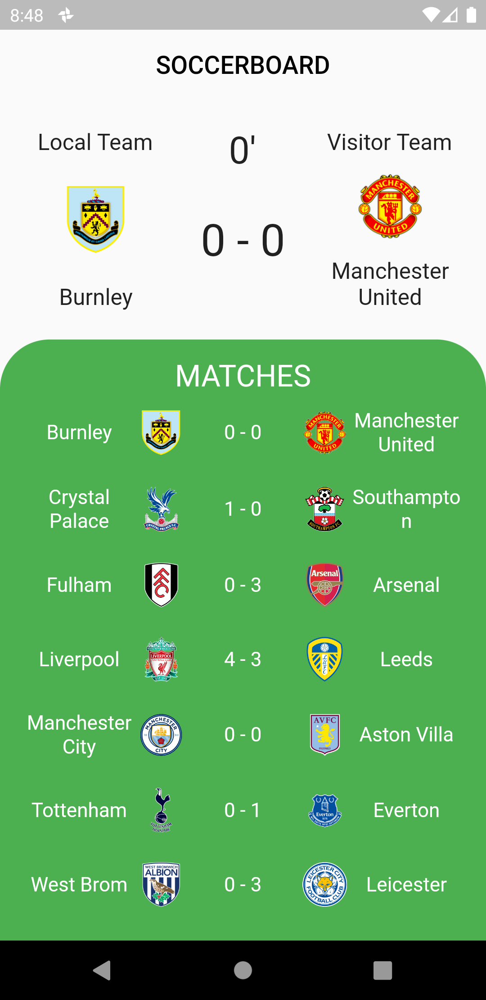

<h1 align="center">SoccerBoard App</h1>
<p align="center">Soccer scoreboard App made using Flutter and API-FOOTBALL</p>
<p align="center">
  
</p>

## Getting Started

This project is a starting point for a Flutter application.

API website: https://www.api-football.com/

You can register a new API key in [rapidapi](https://rapidapi.com/api-sports/api/api-football-beta/pricing) or directly on our [dashboard](https://dashboard.api-football.com/register). 


``` dart
  static const headers = {
    'x-rapidapi-host': "v3.football.api-sports.io",
    'x-rapidapi-key': "YOUR_API_KEY"
  };
```

A few resources to get you started if this is your first Flutter project:

- [Lab: Write your first Flutter app](https://flutter.dev/docs/get-started/codelab)
- [Cookbook: Useful Flutter samples](https://flutter.dev/docs/cookbook)

For help getting started with Flutter, view our
[online documentation](https://flutter.dev/docs), which offers tutorials,
samples, guidance on mobile development, and a full API reference.
